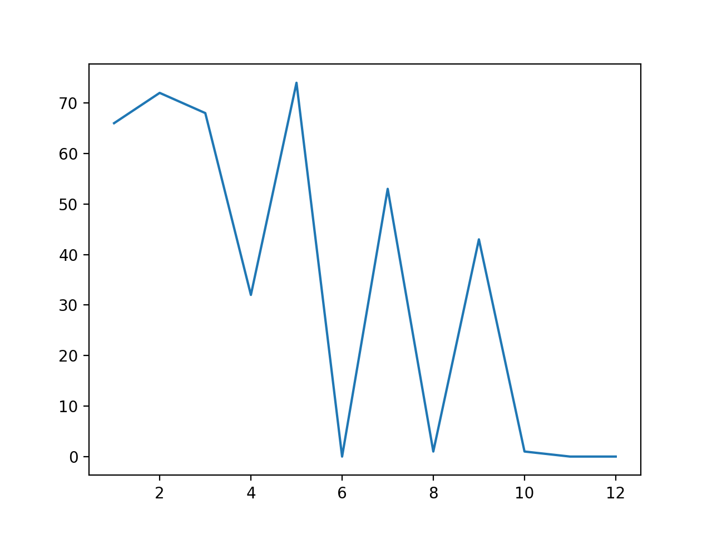
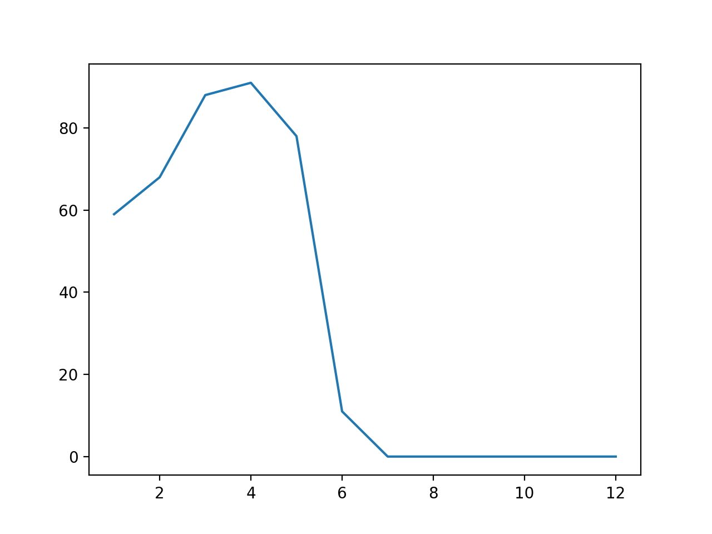

# Article Analysis

In the following project we are tryoing to understand WhatsApp related deaths which have been a rise of concern in India during the past two years. 

For the following project we have extracted News Article from the Times of India from 2017 to 2018 June. 

The idea is to understand the number of such cases in such different places as a part of understanding Fake News


### Features

- Used Scrapy to automate our webscrapping while running it on multiple threads.

- We then stored all our data in a data.csv file which containes the file, the link and extracted information such as place, month, year and the keywords which we were looking for.

- Since TOI's website didn't directly lead to the news articles, we had to perform multiple steps in order to the articles we wanted. 

- Thus it first involved an initial extraction of links from an archive list. We then used the foillowing links to pick the articles.


## Data Retrieved.

tagwords for which the following data was retrieved. The articles were to contain 3 or more of the keywords, with words such as 'WhatsApp' and 'deaths' being a compulsion

- 'police'
- 'arrest'
- 'crime'
- 'jail'
- 'lynch'
- 'kill'
- 'riots'
-  'hate'
- 'death'
- 'dead'-
- 'fir'


```
{'hyderabad': 36, 'sangam': 1, 'karwar': 2, 'guwahati': 5, 'mumbai': 73, 'thane': 6, 'raipur': 4, 'krishnagiri': 1, 'amritsar': 2, 'pilibhit': 2, 'kannur': 1, 'thrissur': 1, 'coimbatore': 9, 'chennai': 19, 'tripunithura': 1, 'noida': 18, 'vasco': 1, 'agartala': 1, 'allahabad': 1, 'rudrapur': 1, 'panchkula': 5, 'meerut': 1, 'manali': 1, 'surat': 2, 'bhiwandi': 1, 'darjeeling': 1, 'madurai': 8, 'attari': 1, 'kozhikode': 2, 'panaji': 5, 'goa': 1, 'rohtak': 2, 'burdwan': 1, 'bareilly': 4, 'bhopal': 15, 'shimla': 4, 'chenna': 1, 'chandrapur': 1, 'vijayawada': 4, 'chikkamagaluru': 1, 'bhubaneswar': 2, 'pune': 20, 'lucknow': 27, 'jaipur': 10, 'ambernath': 1, 'barwani': 1, 'puducherry': 3, 'hubballi': 3, 'kanpur': 6, 'titwala': 1, 'dehradun': 3, 'ballia': 1, 'guirgaon': 1, 'dharamshala': 3, 'agra': 6, 'ranchi': 3, 'NA': 188, 'bengaluru': 32, 'patna': 14, 'mangaluru': 6, 'jaisalmer': 1, 'chandigarh': 21, 'erode': 1, 'rajkot': 3, 'jabalpur': 1, 'tuticorin': 1, 'palwal': 1, 'udupi': 1, 'ahmedabad': 12, 'gurugram': 15, 'kota': 1, 'tirupur': 1, 'kanyakumari': 1, 'gaya': 1, 'bijnor': 1, 'bankura': 1, 'palanpur': 1, 'indore': 7, 'kolhapur': 1, 'patiala': 5, 'ghaziabad': 7, 'visakhapatnam': 7, 'thiruvananthapuram': 7, 'jamshedpur': 1, 'salem': 2, 'nashik': 3, 'ludhiana': 15, 'mysuru': 2, 'trichy': 4, 'kendrapada': 1, 'tirupati': 1, 'varanasi': 1, 'vadodara': 22, 'ambala': 2, 'itanagar': 1, 'kolkata': 25, 'gurgaon': 2, 'tiruvannamalai': 1, 'aurangabad': 3, 'srinagar': 4, 'nawada': 1, 'imphal': 4, 'ajnala': 1, 'thiruvanathapuram': 2, 'nagpur': 22, 'malappuram': 3, 'bathinda': 4, 'kochi': 3}
```


And have got the following visualization related to the number of such cases in the year 2017 




And the following for the year 2018



A drastic decrease in July is because, data is only till June of 2018


## Future Scope

The following data can be used by anyone who wishes. Do feel free to open a PR to add additonal visualizations or any other data which you could extract from it.